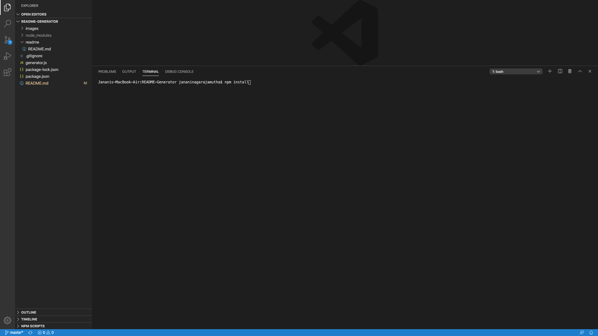
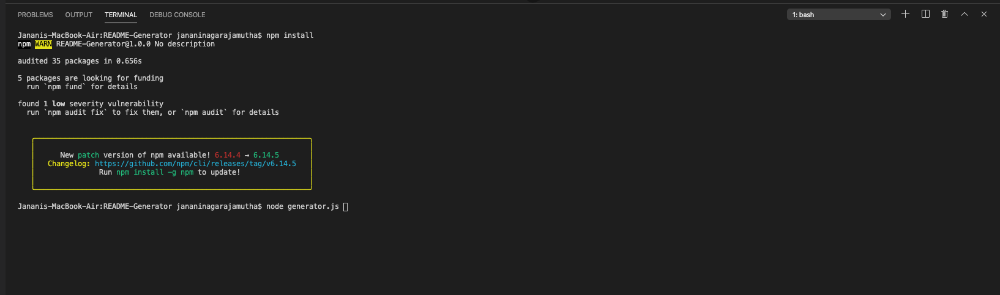
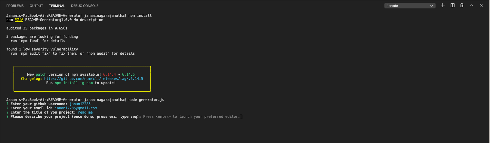

# README-GENERATOR


## Description 

This repository consists of code that generates a readme markdown file.

The application collects user input through command line interface, which is implemented using npm inquirer. Once the data is collected, the content is framed using template literials. The content is written into readme/README.md file using node's file system package.

Git is used for version controlling and for periodic commits to Gitlab.

## Installation

``` npm install ``` command is run in terminal(Mac) or command promt(windows) to install all needed packages to run this application.


## Screenshots of the application





